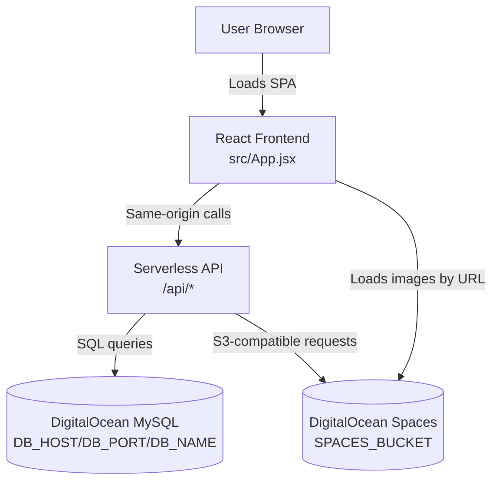
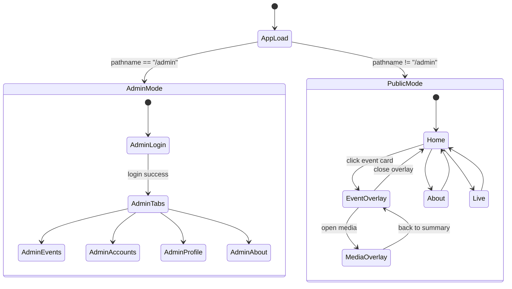
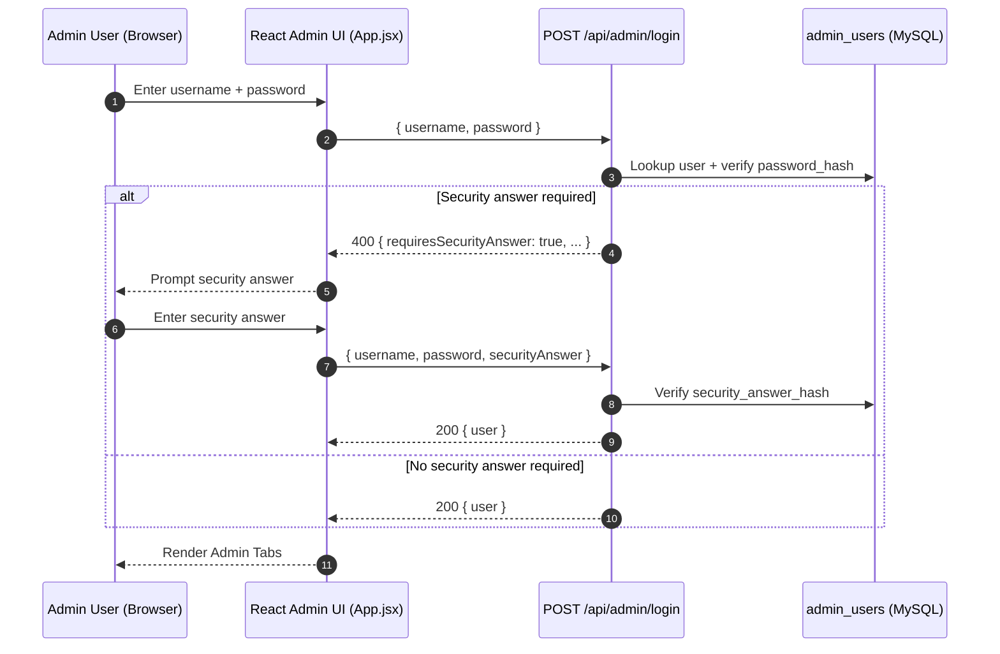
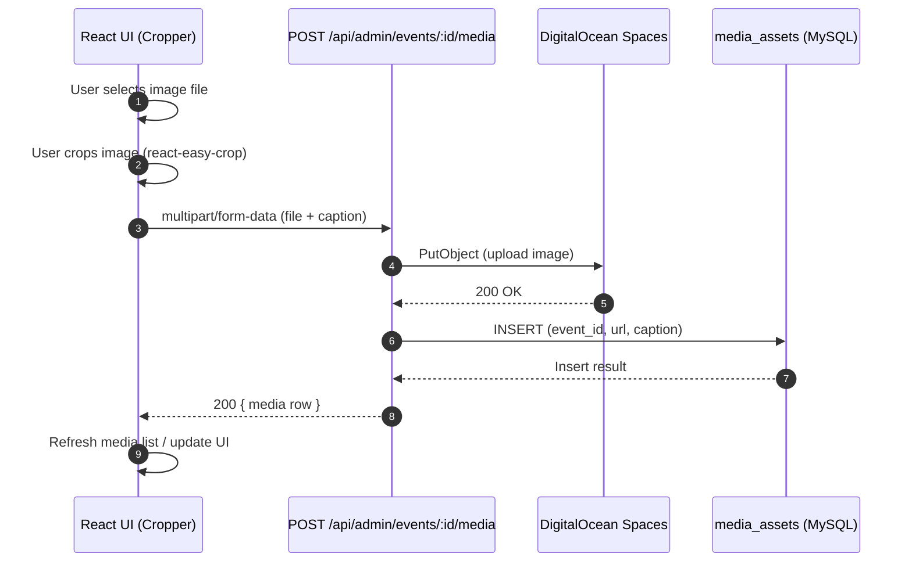
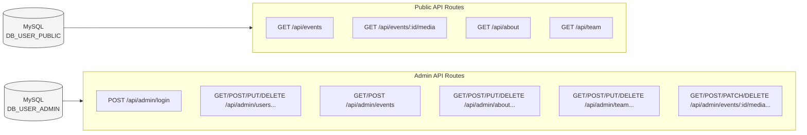

# Solar Events Interactive Web Portal
## Project README & Developer Handoff Documentation

---

## 1. Purpose of This Document

This document serves as the **authoritative technical handoff reference** for the Solar Events Interactive Web Portal.
It is intended for developers who are inheriting the project and need a complete, accurate understanding of:

- How the application is structured
- How navigation and state management work
- What each API route does
- How database access is separated
- How media uploads are handled
- How CSS is organized and applied
- How environment variables are used

This README is based **only on the current codebase** and reflects the application exactly as implemented.

---

## 2. Project Overview

The Solar Events Interactive Web Portal is a single-page React application that presents historical solar events through an interactive timeline.  
It includes an embedded admin interface that allows authenticated users to manage all site content.

The application consists of:

- One React frontend (`src/App.jsx`)
- One global stylesheet (`src/App.css`)
- Serverless API routes under `/api`
- A MySQL database hosted on DigitalOcean
- DigitalOcean Spaces for media storage

The frontend and backend are deployed together and communicate via same-origin API calls.

---

## 3. Technology Stack

### Frontend
- React
- Plain CSS
- react-easy-crop (image cropping)

### Backend
- Node.js (ES Modules)
- Serverless API routes

### Infrastructure
- DigitalOcean Managed MySQL
- DigitalOcean Spaces (S3-compatible)

---

## 4. Environment Variables

### Database (Shared)
Used by both public and admin APIs.

- DB_HOST
- DB_PORT
- DB_NAME

### Public Database User (Read-Only)
Used by public-facing API routes only.

- DB_USER_PUBLIC
- DB_PASSWORD_PUBLIC

### Admin Database User
Used by admin API routes with limited CRUD permissions.

- DB_USER_ADMIN
- DB_PASSWORD_ADMIN

### DigitalOcean Spaces
Used for storing:
- Event newspaper articles
- Team member profile images

- SPACES_KEY
- SPACES_SECRET
- SPACES_BUCKET
- SPACES_REGION
- SPACES_ENDPOINT
- SPACES_ORIGIN_URL

SPACES_ORIGIN_URL is used to construct publicly accessible image URLs that are persisted in the database.

---

## 5. Repository Structure

```
/src
  App.jsx        Entire frontend application
  App.css        Entire stylesheet

/api
  events.js
  about.js
  team.js
  events/[id]/media.js

  /admin
    login.js
    users.js
    users/[id]/index.js
    security-questions.js
    events.js
    about.js
    about/[id]/index.js
    team.js
    team/[id]/index.js
    team/[id]/photo.js
    events/[id]/media/index.js
    events/[id]/media/[mediaId].js
```

---

## 6. Frontend Architecture (App.jsx)

The entire frontend is implemented inside a single React component file.
All UI, state management, modal logic, admin workflows, and data fetching occur here.

### Core Responsibilities
- Fetching public data
- Managing view state
- Rendering overlays and modals
- Handling admin CRUD flows
- Uploading and managing images
- Error isolation via ErrorBoundary

---

## 7. ErrorBoundary

A custom ErrorBoundary class wraps the application.

Purpose:
- Prevent runtime errors inside admin modals from crashing the entire app
- Display error details inline for debugging

---

## 8. Navigation & View State

Navigation is controlled entirely by React state.

### Public Views
- home: Timeline view
- about: About page + team
- live: Placeholder

### Admin Mode
- Automatically enabled when path === /admin
- Overrides public UI
- Displays admin tabs

No routing library is used.

---

## 9. Timeline (Home View)

### Behavior
- Fetches events from GET /api/events
- Groups events by year
- Sorts events client-side by:
  - Year
  - Month
  - Day

### Interaction
- Clicking an event opens the event detail overlay

---

## 10. Event Detail Overlay

Displays:
- Event date
- Title
- Event type
- Location
- Summary
- Impact on communication

Provides navigation back to the timeline and access to related media.

---

## 11. Media Overlay (Newspaper Articles)

- Fetches from GET /api/events/:id/media
- Displays one image at a time
- Supports:
  - Next / Previous navigation
  - Caption display
  - Back-to-summary navigation

---

## 12. About View

- Fetches sections from GET /api/about
- Sections rendered by display_order
- Fetches team members from GET /api/team

Team cards display:
- Profile image
- Name
- Role

---

## 13. Admin Interface Overview

The admin UI is embedded within App.jsx and activated by /admin.

### Admin Login
- Username + password
- Optional security question flow
- Uses POST /api/admin/login

---

## 14. Admin Tabs

- Events
- Accounts
- Profile
- About

Each tab manages its own internal state and API interactions.

---

## 15. Admin: Events

Capabilities:
- View event list
- Create events
- Edit events
- Upload newspaper articles
- Delete articles with confirmation

### Media Upload Logic
- Edit mode: uploads immediately
- Create mode: files are queued locally until event creation

---

## 16. Admin: Media Handling

- Image cropping via react-easy-crop
- Preview before upload
- Caption editing
- Stored in DigitalOcean Spaces
- Public URL saved in media_assets table

---

## 17. Admin: Accounts

- List admin users
- Create admin users
- Edit admin users
- Delete admin users
- Protected accounts cannot be modified or deleted

---

## 18. Admin: Profile

- Displays security question configuration
- Fetches from GET /api/admin/security-questions

---

## 19. Admin: About Page

- Create sections
- Edit sections
- Delete sections
- Ordering controlled by display_order

---

## 20. API Routes

### Public API
- GET /api/events
- GET /api/events/:id/media
- GET /api/about
- GET /api/team

### Admin API
Authentication:
- POST /api/admin/login
- GET /api/admin/security-questions

Users:
- GET /api/admin/users
- POST /api/admin/users
- PUT /api/admin/users/:id
- DELETE /api/admin/users/:id

Events:
- GET /api/admin/events
- POST /api/admin/events

About:
- GET /api/admin/about
- POST /api/admin/about
- PUT /api/admin/about/:id
- DELETE /api/admin/about/:id

Team:
- GET /api/admin/team
- POST /api/admin/team
- PUT /api/admin/team/:id
- DELETE /api/admin/team/:id
- POST /api/admin/team/:id/photo
- DELETE /api/admin/team/:id/photo

Media:
- GET /api/admin/events/:id/media
- POST /api/admin/events/:id/media
- PATCH /api/admin/events/:eventId/media/:mediaId
- DELETE /api/admin/events/:eventId/media/:mediaId

---

## 21. Database Tables

- solar_events
- media_assets
- about_sections
- team_members
- admin_users
- security_questions

Public APIs use the public DB user.
Admin APIs use the admin DB user.

---

## 22. CSS Architecture (App.css)

CSS is organized by functional sections:
- Global layout & typography
- Timeline cards
- Event overlays
- Media overlays
- Admin layout
- Admin modals
- Forms & inputs
- Buttons (primary, ghost, danger)
- Image cropper
- Delete confirmation dialogs

No CSS framework is used.

---

## 23. Deployment Model

- Frontend and API deployed together
- Same-origin API access
- Images served directly from DigitalOcean Spaces
- Database and Spaces are managed externally

---

## 24. Final Notes

- All frontend logic exists in App.jsx
- All styling exists in App.css
- Admin workflows are client-driven
- Media integrity depends on DB and Spaces alignment

This document reflects the project exactly as implemented at the time of handoff.

---


---

## 25. Diagrams (Embedded in Markdown via Mermaid)

> These diagrams are written in **Mermaid** so they live directly inside this `.md` file.
> They render automatically on GitHub and other Mermaid-enabled Markdown viewers.

### 25.1 System Architecture (Frontend + API + Data Stores)



### 25.2 Public Navigation & View State (No Router)



### 25.3 Admin Login Flow (Including Optional Security Question)



### 25.4 Event Management Lifecycle (Admin)

```mermaid
flowchart TD
  E0[Admin opens Events tab] --> E1[Fetch list\nGET /api/admin/events]
  E1 --> E2[Select "Create" or "Edit"]

  E2 -->|Create| C0[Open Create Event modal]
  C0 --> C1[Fill event fields]
  C1 --> C2[Optionally add article images\n(queued locally)]
  C2 --> C3[Save event\nPOST /api/admin/events]
  C3 --> C4[Event ID returned]
  C4 --> C5[Upload queued media\nPOST /api/admin/events/:id/media]
  C5 --> E1

  E2 -->|Edit| U0[Open Edit Event modal]
  U0 --> U1[Update event fields (as implemented)]
  U1 --> U2[Upload media immediately\nPOST /api/admin/events/:id/media]
  U2 --> U3[Edit captions\nPATCH /api/admin/events/:eventId/media/:mediaId]
  U3 --> U4[Delete media\nDELETE /api/admin/events/:eventId/media/:mediaId]
  U4 --> E1
```

### 25.5 Media Upload Pipeline (Crop → Upload → Persist)



### 25.6 Database Access Separation (Public vs Admin)



---

END OF DOCUMENTATION
